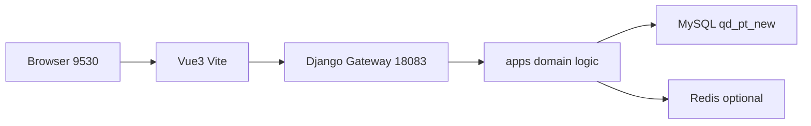
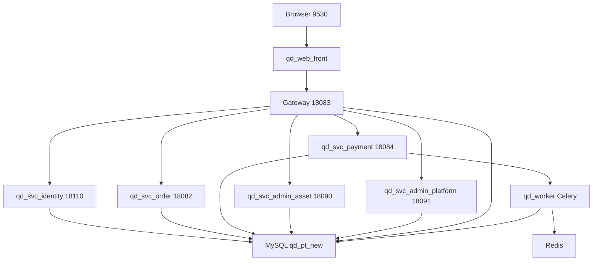
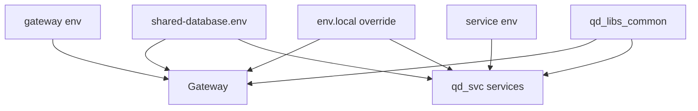
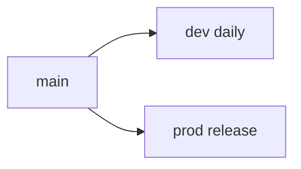
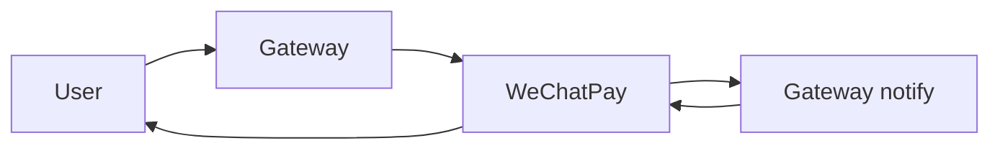
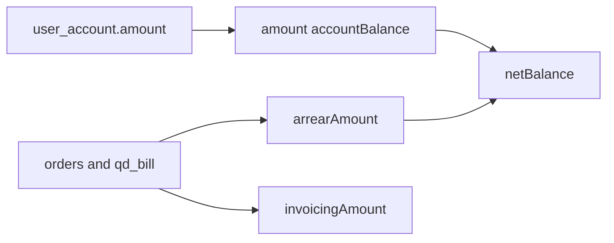

# utoo-pydjango

青岛检测平台 **全栈 monorepo**：Vue3 前端 + Django 网关 + 微服务 + 公共库 + Worker。

| 项 | 值 |
|----|-----|
| GitLab | http://gitlab.wisecom-tech.com/web/utoo-pydjango.git |
| 开发分支 | **`dev`**（日常推送） |
| 生产分支 | **`prod`** |
| 前端 | `qd_web_front`（C 端 + 管理后台单 SPA）→ http://127.0.0.1:**9530** |
| 网关 | `qd_test_server_django` → http://127.0.0.1:**18083** |

```powershell
git clone http://gitlab.wisecom-tech.com/web/utoo-pydjango.git
cd utoo-pydjango
git checkout dev
```

---

## 1. 仓库结构

| 目录 | 端口 | 说明 |
|------|------|------|
| **`qd_web_front`** | **9530** | Vue3 **统一前端**（C 端 `#/...` + 管理后台 `#/admin/...`） |
| ~~`qd_test_front_v3`~~ | — | **已废弃** → 并入 `qd_web_front/src/client` |
| ~~`qd_admin_front`~~ | — | **已废弃** → 并入 `qd_web_front/src/admin` |
| `qd_test_server_django` | **18083** | API **网关 / BFF**（登录转发身份中台；短信/微信一键仍在网关） |
| `qd_svc_identity` | **18110** | **身份中台**（员工/会员密码登录、菜单）；生产蓝绿 **18081/18181**，稳定口 **19081** |
| `qd_svc_order` | 18082 | 订单 + 后台实验管理 |
| `qd_svc_payment` | **18084** | 支付 / 资产 + **微信 `/api/wx/*`**（原 wx 已并入） |
| `qd_svc_admin_asset` | **18090** | 后台：数字化 / 库存 / 资金 |
| `qd_svc_admin_platform` | **18091** | 后台：会员/运营/系统/服务/设置 + C 端入驻/发票 |
| ~~`qd_svc_auth`~~ | ~~18081~~ | **已删除** → 密码登录走 `qd_svc_identity`（端口给身份中台蓝槽） |
| ~~`qd_svc_wx`~~ | ~~18087~~ | **已废弃** → 并入 `qd_svc_payment` |
| `qd_svc_invoice` | ~~18085~~ | **已废弃** → 并入 `qd_svc_admin_platform` |
| `qd_svc_entry` | ~~18086~~ | **已废弃** → 并入 `qd_svc_admin_platform` |
| `qd_libs_common` | — | 公共包 `qd_common`（响应体、序列化等） |
| `qd_worker` | — | Celery Worker（异步任务） |
| `config/` | — | 共用数据库模板 `shared-database.env.example` |
| `scripts/` | — | `start-ms-dev.ps1`（网关+身份中台+4 svc）、`start-identity.ps1`、`start-order-pilot.ps1` |

对照仓库（不在本 monorepo 内）：

| 目录 | 角色 |
|------|------|
| `qd_test_server` | Java 旧服务（只读对照） |
| `qd_test_server_py` | FastAPI 参考实现（**冻结**） |
| `qd_test_front` | 旧 Vue2 前端（可选对照） |

---

## 2. 总体架构

### 2.1 请求链路（日常开发：单体网关）

不配置 `SVC_*_URL` 时，浏览器只打前端，业务全部在网关进程内处理。



### 2.2 微服务模式（配置 `SVC_*_URL` 后）

网关只做鉴权兼容路由与 HTTP 转发，域逻辑下沉到各 `qd_svc_*`。



密码登录走身份中台（配 `SVC_IDENTITY_URL`；本机 **18110**，生产 Nginx **19081**）。勿设 `SVC_AUTH_URL`，目录 `qd_svc_auth` 已删除。  
`/api/wx/*` 由 `qd_svc_payment` 提供（`SVC_WX_URL` 与 `SVC_PAYMENT_URL` 同指 **18084**）。  
入驻/发票：`SVC_ENTRY_URL` / `SVC_INVOICE_URL` → **18091**。勿再启已废弃的 `qd_svc_wx` / `qd_svc_entry` / `qd_svc_invoice`。

### 2.3 配置与依赖关系



**约定：**

- 迁移期 **共用一个 MySQL 库** `qd_pt_new`
- **禁止**微服务之间直接 `import` 对方业务模块；用 HTTP 或 Celery
- JWT 密钥须全仓一致（写在 `shared-database.env`）

---

## 3. 分支约定

| 分支 | 用途 |
|------|------|
| **`dev`** | 日常开发、联调（默认推送目标） |
| **`prod`** | 生产发布 |
| `main` | 与完整代码对齐时可同步 |



---

## 4. 快速启动

### 4.1 推荐：前端 + 单体网关

日常联调 **不必** 启动全部微服务。浏览器只访问前端 **9530**。

```powershell
# 0) 共用数据库
copy config\shared-database.env.example config\shared-database.env
# 编辑 DB_HOST / DB_USER / DB_PASSWORD / DB_NAME / JWT_SECRET_KEY
# MySQL 5.6 请设 DB_LEGACY_MYSQL=true

# 1) 网关（终端 A）
cd qd_test_server_django
python -m venv .venv
.\.venv\Scripts\activate
pip install -r requirements.txt
copy .env.example .env
python run.py

# 2) 统一前端（终端 B）
cd qd_web_front
npm install
# 默认 VITE_API_TARGET=http://127.0.0.1:18083
npm run dev
```

| 地址 | 说明 |
|------|------|
| http://127.0.0.1:**9530**/#/home | C 端 |
| http://127.0.0.1:**9530**/#/admin/login | 管理后台 |
| http://127.0.0.1:**18083** | 网关 API |
| `GET /health` | 网关健康检查 |

若完整工作区在 `E:\utoo`：

```powershell
E:\utoo\dev-start.bat                 # 网关 + Vue3
E:\utoo\scripts\start-gateway.ps1     # 仅网关
E:\utoo\scripts\start-front-v3.ps1    # 仅前端
```

### 4.2 启动单个微服务

```powershell
cd qd_svc_identity   # 或 order / payment / admin_asset / admin_platform（勿再启 wx）
python -m venv .venv
.\.venv\Scripts\activate
pip install -r requirements.txt
copy .env.example .env
# 确保仓库根目录已有 config/shared-database.env
python run.py
```


或使用仓库根脚本：

```powershell
.\scripts\start-gateway.ps1
.\scripts\start-identity.ps1         # 身份中台 :18110
.\scripts\start-order.ps1
.\scripts\start-payment.ps1          # 含原 /api/wx/*
.\scripts\start-admin-asset.ps1
.\scripts\start-admin-platform.ps1

# 或一键开 6 个终端（网关 + identity + order + payment + asset + platform）
.\scripts\start-ms-dev.ps1

# 对内中台：仅订单试点（网关 + order）
.\scripts\start-order-pilot.ps1
```

> `qd_svc_auth` 已从仓库删除。`qd_svc_wx` / `qd_svc_entry` / `qd_svc_invoice` 已废弃。  
> 发版切流：[`deploy/README.md`](deploy/README.md)#身份中台首次上线登录切流。  
> 现网说明：`E:\utoo\docs\现网架构说明.md`。

### 4.3 开启微服务转发

在 **网关** `.env` 中填写（模板见 `qd_test_server_django/.env.example`）：

```env
# 勿设 SVC_AUTH_URL
# 本机身份中台；生产经 Nginx：http://127.0.0.1:19081
SVC_IDENTITY_URL=http://127.0.0.1:18110
SVC_ORDER_URL=http://127.0.0.1:18082
SVC_PAYMENT_URL=http://127.0.0.1:18084
SVC_WX_URL=http://127.0.0.1:18084
SVC_ADMIN_ASSET_URL=http://127.0.0.1:18090
SVC_ADMIN_PLATFORM_URL=http://127.0.0.1:18091
SVC_INVOICE_URL=http://127.0.0.1:18091
SVC_ENTRY_URL=http://127.0.0.1:18091
```

**行为说明：**

- 已配置的 `SVC_*`：该域请求由网关 **HTTP 转发**到对应服务；上游未启动则接口 **503**（不再静默走本地 twin）。
- 未配置的 `SVC_*`：仍走网关本地 `apps.*`（单体兜底）。
- **密码登录**：配了 `SVC_IDENTITY_URL` 则转发 `qd_svc_identity`；空则回退网关本地（回滚）。短信/微信一键仍在网关。
- 网关仍保留 `admin_auth` / `auth_pc` 适配层（路径兼容与回滚），不是漏配。
- 修改 `.env` 后需**重启网关**进程；可用 `.\scripts\start-ms-dev.ps1` 拉齐进程。
- 支付异步队列可选再启 `qd_worker`，非菜单硬依赖。

---

## 5. 配置说明

### 5.1 加载顺序

1. 各服务 `.env`（端口、Redis、微信、OSS…）
2. 仓库根 `config/shared-database.env`（**DB_\***、**JWT_SECRET_KEY**）
3. 各服务 `.env.local`（本机覆盖，**不提交**）

### 5.2 常用变量

| 变量 | 位置 | 说明 |
|------|------|------|
| `DB_*` / `DB_LEGACY_MYSQL` | `shared-database.env` | 业务库；5.6 设 `true` |
| `JWT_SECRET_KEY` | `shared-database.env` | 全服务一致 |
| `SERVER_PORT_HTTP` | 各服务 `.env` | 见上表端口 |
| `REDIS_*` | 网关 / payment | 支付锁、队列 |
| `CORS_HTTPS` | 网关 `.env` | 微信支付回调公网根（**勿带 `/api`**） |
| `PAY_DEBUG_ENABLED` | 网关 `.env` | 支付调试开关 |
| `SVC_IDENTITY_URL` | 网关 `.env` | 身份中台；本机 `:18110`，生产 `:19081` |
| `SVC_*_URL` | 网关 `.env` | 其它微服务上游（可选） |

### 5.3 勿提交

- 后端：`.env` / `.env.local`、`config/shared-database.env`、`.venv/`、`*.pem`
- 前端：`.env.development.local`、`node_modules/`、`dist/`
- `__pycache__`、`.pytest_cache`

### 5.4 前端环境

| 文件 | 说明 |
|------|------|
| `.env.development` | 默认开发配置（可提交） |
| `.env.development.local` | 本机覆盖（**不提交**），如 `VITE_API_TARGET` |
| `.env.development.local.example` | 本地覆盖模板 |

```env
# qd_test_front_v3/.env.development.local
VITE_API_TARGET=http://127.0.0.1:18083
```

---

## 6. 主要 API 前缀（网关）

| 前缀 | 说明 |
|------|------|
| `/api/auth/` | 登录、刷新、当前用户 |
| `/api/pc/` | C 端兼容 `.ajax`（资产、个人中心等） |
| `/api/experimentOrder/` | 主订单 |
| `/api/experimentChildOrder/` | 实验子订单 |
| `/api/invoice/` | 发票 |
| `/api/entry/` | 入驻 |
| `/api/wx/` | 微信 |
| `/api/offlineRecharge/` 等 | 充值 / 兑换等 |

### 微信支付回调（公网）

由 `CORS_HTTPS` + `/api` 拼接：



| 场景 | 回调路径 |
|------|----------|
| 订单支付 | `{CORS_HTTPS}/api/pc/pay.ajax` |
| 充值 | `{CORS_HTTPS}/api/pc/rechargePay.ajax` |
| 还款 / 多选支付 | `{CORS_HTTPS}/api/pc/amountPayBack.ajax` |

本地 `127.0.0.1` 微信无法直连；联调用 UAT 公网或内网穿透。

---

## 7. 资产金额逻辑（简要）

「我的资产」接口：`GET /api/pc/center/getAccount.ajax`



- **余额支付**扣的是 `user_account.amount`，不是「余额 − 全部待支付」后的展示值
- 所选订单应付合计超过账户余额时，接口返回「余额不足」属正常

---

## 8. Celery

```powershell
cd qd_test_server_django
.\scripts\run_celery_worker.ps1
```

需 Redis；`PAY_NOTIFY_USE_QUEUE=true` 时微信回调可走队列。

---

## 9. 测试

```powershell
cd qd_test_server_django
.\.venv\Scripts\activate
python -m pytest tests/ -q
python manage.py check
```

**注意：** 业务库联调使用 `live_client`，**不要**把测试库名配成业务库 `qd_pt_new`（曾导致误删库，已修复）。

---

## 10. 目录速览（网关）

```
qd_test_server_django/
  config/          # settings、urls、celery、MySQL 5.6 legacy
  apps/
    core/          # 健康检查、转发、中间件
    auth_pc/       # 登录适配（配 SVC_IDENTITY_URL 则转发中台）
    pc_compat/     # /api/pc/*.ajax
    orders/ payments/ invoices/ entry/ wx/
  tasks/           # Celery
  scripts/ tests/
```

共享库：`qd_libs_common/qd_common/` → `from qd_common.responses import api_ok`。

---

## 11. 前端目录速览

```
qd_web_front/
  src/
    client/        # 原 C 端（Vuex，#/home、#/b/...）
    admin/         # 原管理后台（Pinia，#/admin/...）
    router/        # 合并路由
    main.ts
  vite.config.ts   # 开发代理 /api → 网关 :9530
  package.json
```

```powershell
cd qd_web_front
npm run dev      # http://127.0.0.1:9530
npm run build    # 产出 dist/
```

---

## 12. 相关文档

| 文档 | 说明 |
|------|------|
| `qd_web_front/README.md` | 统一前端说明 |
| `qd_test_server_django/README.md` | 网关细节 |
| **`deploy/README.md`** | **GitLab CI/CD 发版** |
| **`E:\utoo\docs\现网架构说明.md`** | **现网架构 / 端口 / 身份切流（唯一入口）** |
| `qd_svc_identity/README.md` | 身份中台 |
| `docs/小程序对接Django.md` | 小程序对接 |
| `E:\utoo\docs\API对照表.md` | C 端接口对照 |
