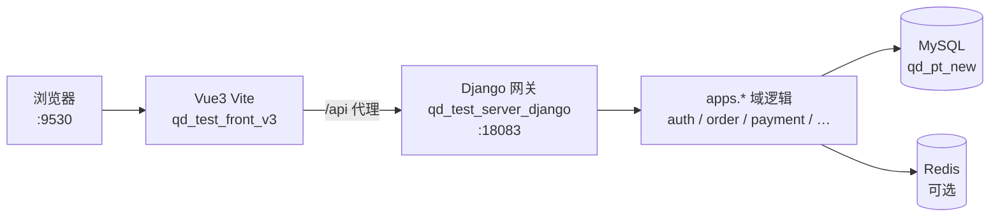
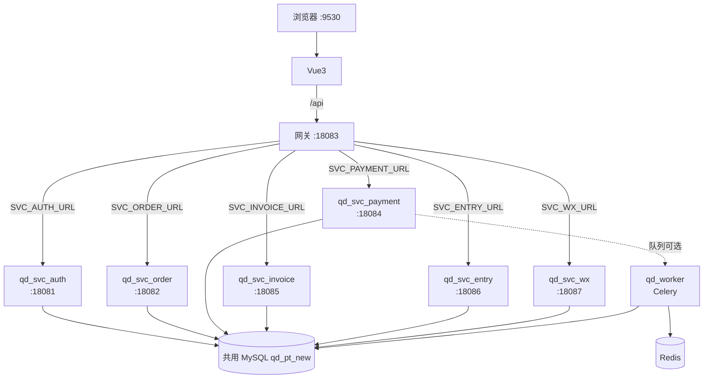
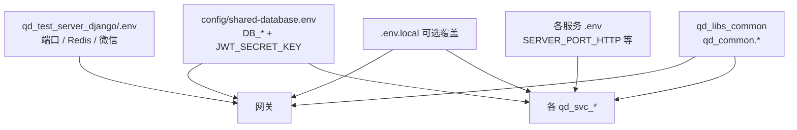
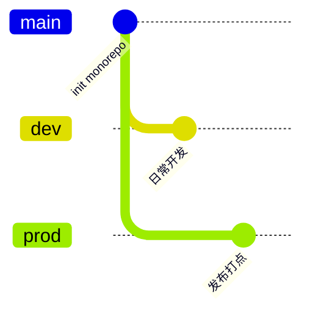
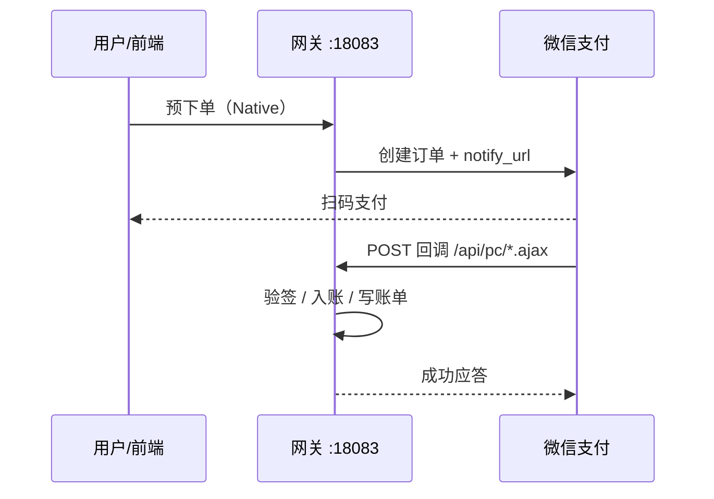
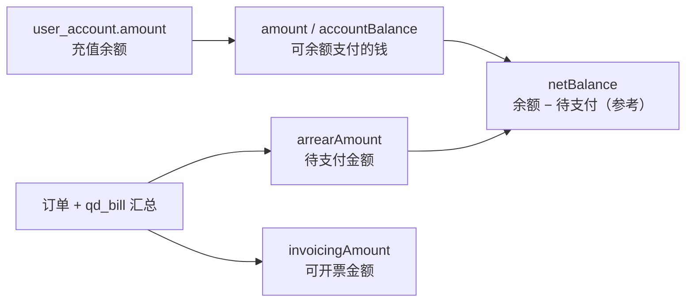

# utoo-pydjango

青岛检测平台 **Python / Django** 后端 monorepo（网关 + 微服务 + 公共库 + Worker）。

| 项 | 值 |
|----|-----|
| GitLab | http://gitlab.wisecom-tech.com/TZJ/utoo-pydjango.git |
| 开发分支 | **`dev`**（日常推送） |
| 生产分支 | **`prod`** |
| 网关默认端口 | **18083** |
| 前端 | `qd_test_front_v3` → http://127.0.0.1:9530（`/api` 代理到网关） |

```powershell
git clone http://gitlab.wisecom-tech.com/TZJ/utoo-pydjango.git
cd utoo-pydjango
git checkout dev
```

---

## 1. 仓库结构

| 目录 | 端口 | 说明 |
|------|------|------|
| `qd_test_server_django` | **18083** | API **网关 / BFF**（日常开发主入口） |
| `qd_svc_auth` | 18081 | 认证微服务 |
| `qd_svc_order` | 18082 | 订单微服务 |
| `qd_svc_payment` | 18084 | 支付 / 资产微服务 |
| `qd_svc_invoice` | 18085 | 发票微服务 |
| `qd_svc_entry` | 18086 | 入驻微服务 |
| `qd_svc_wx` | 18087 | 微信微服务 |
| `qd_libs_common` | — | 公共包 `qd_common`（响应体、序列化等） |
| `qd_worker` | — | Celery Worker（异步任务） |
| `config/` | — | 共用数据库模板 `shared-database.env.example` |

对照仓库（不在本 monorepo 内）：

| 目录 | 角色 |
|------|------|
| `qd_test_server` | Java 旧服务（只读对照） |
| `qd_test_server_py` | FastAPI 参考实现（**冻结**） |
| `qd_test_front_v3` | Vue3 主前端 |

---

## 2. 总体架构

### 2.1 请求链路（日常开发：单体网关）

不配置 `SVC_*_URL` 时，浏览器只打前端，业务全部在网关进程内处理。



### 2.2 微服务模式（配置 `SVC_*_URL` 后）

网关只做鉴权兼容路由与 HTTP 转发，域逻辑下沉到各 `qd_svc_*`。



### 2.3 配置与依赖关系



**约定：**

- 迁移期 **共用一个 MySQL 库** `qd_pt_new`
- **禁止**微服务之间直接 `import` 对方业务模块；用 HTTP 或 Celery
- JWT 密钥须全仓一致（写在 `shared-database.env`）

---

## 3. 分支约定

| 分支 | 用途 |
|------|------|
| **`dev`** | 日常开发、联调（默认推送目标） |
| **`prod`** | 生产发布 |
| `main` | 与完整代码对齐时可同步 |



---

## 4. 快速启动

### 4.1 推荐：单体网关 + 前端

日常联调 **不必** 启动全部微服务。

```powershell
# 1) 共用数据库
copy config\shared-database.env.example config\shared-database.env
# 编辑 DB_HOST / DB_USER / DB_PASSWORD / DB_NAME / JWT_SECRET_KEY
# MySQL 5.6 请设 DB_LEGACY_MYSQL=true

# 2) 网关
cd qd_test_server_django
python -m venv .venv
.\.venv\Scripts\activate
pip install -r requirements.txt
copy .env.example .env
python run.py
```

| 地址 | 说明 |
|------|------|
| http://127.0.0.1:18083 | 网关 |
| `GET /health` | 健康检查 |
| `GET /api/health/` | 统一响应体健康检查 |

若完整工作区在 `E:\utoo`：

```powershell
E:\utoo\dev-start.bat                 # 网关 + Vue3
E:\utoo\scripts\start-gateway.ps1     # 仅网关
E:\utoo\scripts\start-front-v3.ps1    # 仅前端
```

### 4.2 启动单个微服务

```powershell
cd qd_svc_auth   # 或 order / payment / invoice / entry / wx
python -m venv .venv
.\.venv\Scripts\activate
pip install -r requirements.txt
copy .env.example .env
# 确保仓库根目录已有 config/shared-database.env
python run.py
```

### 4.3 开启微服务转发

在 **网关** `.env` 中取消注释并填写：

```env
SVC_AUTH_URL=http://127.0.0.1:18081
SVC_ORDER_URL=http://127.0.0.1:18082
SVC_PAYMENT_URL=http://127.0.0.1:18084
SVC_INVOICE_URL=http://127.0.0.1:18085
SVC_ENTRY_URL=http://127.0.0.1:18086
SVC_WX_URL=http://127.0.0.1:18087
```

未配置的上游仍走网关本地 `apps.*`。

---

## 5. 配置说明

### 5.1 加载顺序

1. 各服务 `.env`（端口、Redis、微信、OSS…）
2. 仓库根 `config/shared-database.env`（**DB_\***、**JWT_SECRET_KEY**）
3. 各服务 `.env.local`（本机覆盖，**不提交**）

### 5.2 常用变量

| 变量 | 位置 | 说明 |
|------|------|------|
| `DB_*` / `DB_LEGACY_MYSQL` | `shared-database.env` | 业务库；5.6 设 `true` |
| `JWT_SECRET_KEY` | `shared-database.env` | 全服务一致 |
| `SERVER_PORT_HTTP` | 各服务 `.env` | 见上表端口 |
| `REDIS_*` | 网关 / payment | 支付锁、队列 |
| `CORS_HTTPS` | 网关 `.env` | 微信支付回调公网根（**勿带 `/api`**） |
| `PAY_DEBUG_ENABLED` | 网关 `.env` | 支付调试开关 |
| `SVC_*_URL` | 网关 `.env` | 微服务上游（可选） |

### 5.3 勿提交

- `.env` / `.env.local`
- `config/shared-database.env`
- `.venv/`、`*.pem`、证书私钥
- `__pycache__`、`.pytest_cache`

---

## 6. 主要 API 前缀（网关）

| 前缀 | 说明 |
|------|------|
| `/api/auth/` | 登录、刷新、当前用户 |
| `/api/pc/` | C 端兼容 `.ajax`（资产、个人中心等） |
| `/api/experimentOrder/` | 主订单 |
| `/api/experimentChildOrder/` | 实验子订单 |
| `/api/invoice/` | 发票 |
| `/api/entry/` | 入驻 |
| `/api/wx/` | 微信 |
| `/api/offlineRecharge/` 等 | 充值 / 兑换等 |

### 微信支付回调（公网）

由 `CORS_HTTPS` + `/api` 拼接：



| 场景 | 回调路径 |
|------|----------|
| 订单支付 | `{CORS_HTTPS}/api/pc/pay.ajax` |
| 充值 | `{CORS_HTTPS}/api/pc/rechargePay.ajax` |
| 还款 / 多选支付 | `{CORS_HTTPS}/api/pc/amountPayBack.ajax` |

本地 `127.0.0.1` 微信无法直连；联调用 UAT 公网或内网穿透。

---

## 7. 资产金额逻辑（简要）

「我的资产」接口：`GET /api/pc/center/getAccount.ajax`



- **余额支付**扣的是 `user_account.amount`，不是「余额 − 全部待支付」后的展示值
- 所选订单应付合计超过账户余额时，接口返回「余额不足」属正常

---

## 8. Celery

```powershell
cd qd_test_server_django
.\scripts\run_celery_worker.ps1
```

需 Redis；`PAY_NOTIFY_USE_QUEUE=true` 时微信回调可走队列。

---

## 9. 测试

```powershell
cd qd_test_server_django
.\.venv\Scripts\activate
python -m pytest tests/ -q
python manage.py check
```

**注意：** 业务库联调使用 `live_client`，**不要**把测试库名配成业务库 `qd_pt_new`（曾导致误删库，已修复）。

---

## 10. 目录速览（网关）

```
qd_test_server_django/
  config/          # settings、urls、celery、MySQL 5.6 legacy
  apps/
    core/          # 健康检查、转发、中间件
    auth_pc/       # 登录 JWT
    pc_compat/     # /api/pc/*.ajax
    orders/ payments/ invoices/ entry/ wx/
  tasks/           # Celery
  scripts/ tests/
```

共享库：`qd_libs_common/qd_common/` → `from qd_common.responses import api_ok`。

---

## 11. 相关文档

若与完整工作区一并检出，另见：

| 文档 | 说明 |
|------|------|
| `docs/开发启动.md` | 一键启动、环境 |
| `docs/进度总览.md` | 迁移进度 |
| `docs/API对照表.md` | C 端接口对照 |
| `docs/微服务拆分与仓库约定.md` | MS-0~MS-4 约定 |
| `qd_test_server_django/README.md` | 网关细节 |
