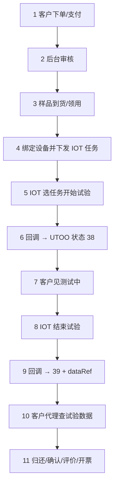
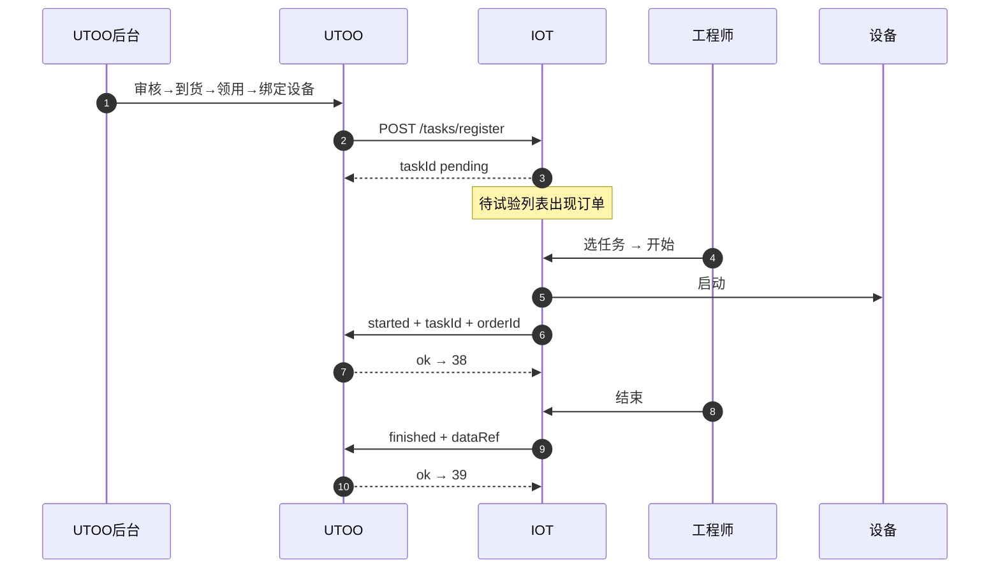
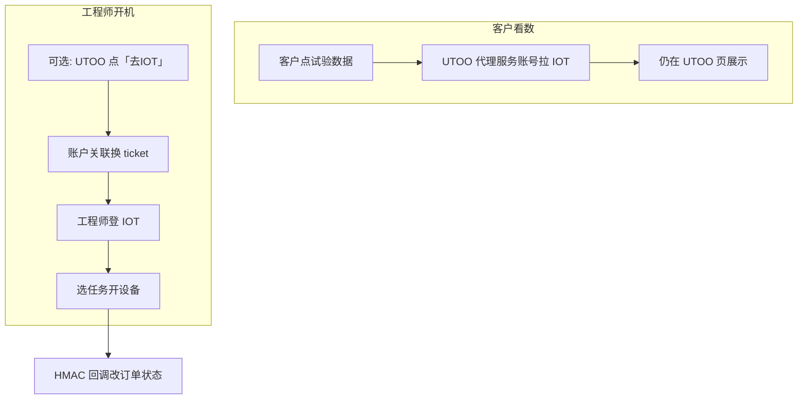
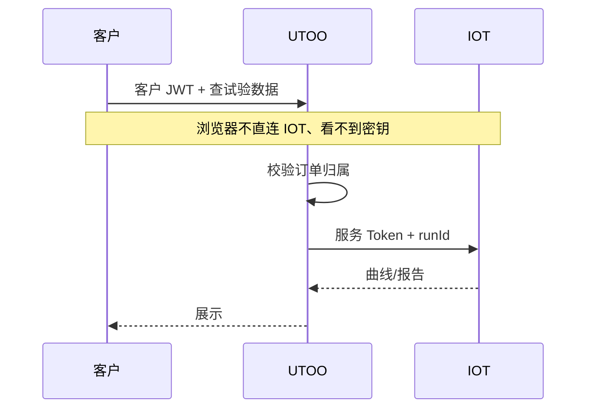
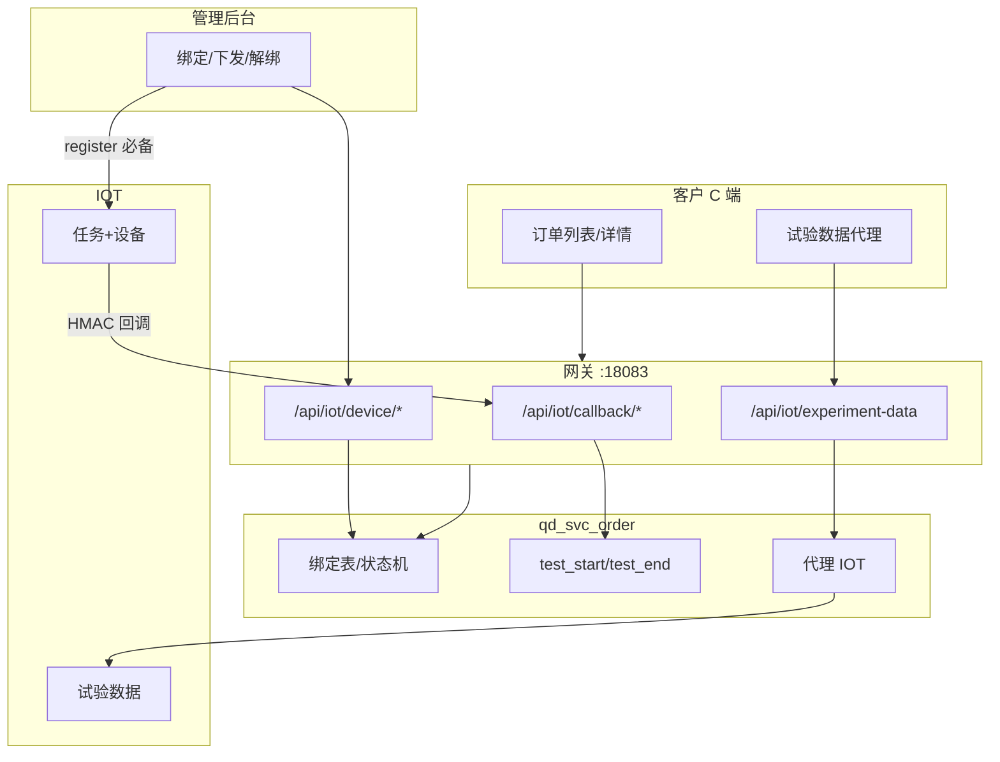
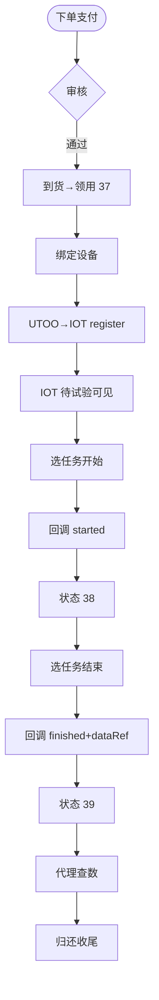
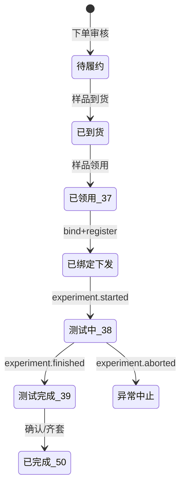
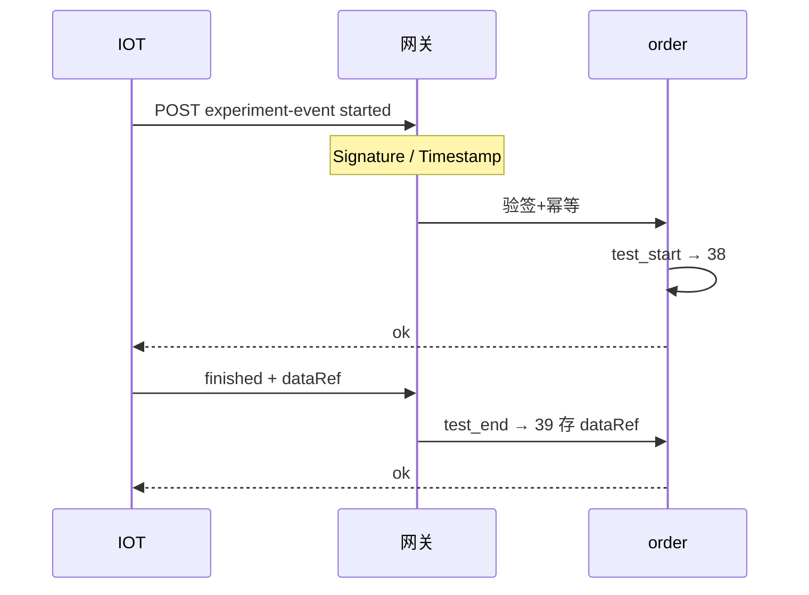

# UTOO × IOT 实验订单联调方案（完整版）

> 目标：实验订单关联设备 → IOT 任务可见 → 开试验回写状态 → C 端查进度与试验数据。  
> IOT 为独立项目；UTOO 仓：`utoo-pydjango`；网关示意：`http://127.0.0.1:18083`。  
> 日期：2026-08

> 环境变量示例：[UTOO-IOT-env.example.env](./UTOO-IOT-env.example.env)
（本文合并原分散的方案 / 操作 / 流程图 / 账号闭环 / 现场任务文档）

---

## 目录

1. [业务目标与原则](#1-业务目标与原则)
2. [UTOO 现状与职责边界](#2-utoo-现状与职责边界)
3. [端到端流程（操作手册）](#3-端到端流程操作手册)
4. [现场任务可见（防盲开机）](#4-现场任务可见防盲开机)
5. [账号、跳转与数据闭环](#5-账号跳转与数据闭环)
6. [流程图与状态机](#6-流程图与状态机)
7. [数据模型](#7-数据模型)
8. [接口说明](#8-接口说明)
9. [落地分期与验收](#9-落地分期与验收)
10. [安全、待确认项与中台关系](#10-安全待确认项与中台关系)

---

## 1. 业务目标与原则

```text
① UTOO 实验订单绑定设备，并下发任务到 IOT（IOT 必须能看到该单）
② 工程师在 IOT「任务」上开试验 → 回调 UTOO → 行状态 38 测试中
③ 试验数据存 IOT；结束回调带 dataRef → 行状态 39 测试完成
④ 客户只登 UTOO：看订单状态 + 经代理查看试验数据（不输 IOT 账密）
```

**三条硬原则：**

1. **先有 IOT 任务，再开机** — 禁止无任务盲开还回写 UTOO  
2. **客户零 IOT 账密** — 数据用 UTOO 服务端代理（或一次性 ticket）  
3. **原始曲线在 IOT** — UTOO 只存绑定 + 状态 + `dataRef` 钥匙  

**实验室墙贴 SOP：**

```text
UTOO：授权 IOT 运维账号 → 按权限选设备 → 绑定/下发
→ 去 IOT「UTOO待办」找订单 → 核对样品 → 开始（WS 控设备 + 回调）
列表里没有该单？回 UTOO 点「重新下发」
不要：IOT 上直接开机再回头找订单
```

---

## 2. UTOO 现状与职责边界

| 项 | 现状 |
|----|------|
| 订单结构 | 主单 `experiment_order` + 产品行 `experiment_order_child` |
| 状态机 | 行级：37 领用 → **38 测试中** → **39 测试完成** → 50 |
| 开始/结束 | `qd_svc_order`：`sample_flow.test_start` / `test_end` |
| 设备字段 | **无**独立 deviceId；展示里的 `deviceName` 实为项目名 |
| C 端列表 | `/api/pc/myExperimentOrderList.ajax`、详情 `orderdetail.ajax` |
| 订单域 webhook | 无（需新建 `/api/iot/callback/*`） |

| 系统 | 负责 | 不负责 |
|------|------|--------|
| **UTOO** | 订单/支付/开票、履约状态、绑定、代理查数 | 海量时序点存储 |
| **IOT** | 任务列表、设备启停、采集、曲线/报告 | 改 UTOO 支付/开票 |

角色：

| 角色 | 系统 | 动作 |
|------|------|------|
| 客户 | 只登 UTOO | 下单、支付、看进度、看试验数据 |
| 商务/调度 | UTOO 后台 | 审核、绑定/下发 |
| 实验室工程师 | UTOO + **IOT 账号** | 样品流转；在 IOT 选任务开/停试验 |
| 系统↔系统 | HMAC / 服务 Token | 回调与查数，无人账密 |

---

## 3. 端到端流程（操作手册）



### 阶段 1～3：下单、审核、样品（仅 UTOO）

| 阶段 | 谁 | 做什么 |
|------|----|--------|
| 1 下单支付 | 客户 | C 端下单、支付；IOT 无感知 |
| 2 审核 | 调度 | 提交审核 → 审核通过 |
| 3 到货/领用 | 实验室 | 样品到货 → 样品领用（≈37） |

接入 IOT 后：**开始/结束测试以 IOT 回调为准**；UTOO 原按钮仅作离线兜底。

### 阶段 4：授权 + 绑定 + 下发（必须让 IOT 看得见单）

**时机：** 到货/领用后、上机前。**原则：先有任务再开机。**

| 步骤 | 做法 |
|------|------|
| 1 授权 | UTOO 订单详情「IOT 设备绑定」→ **授权 IOT 运维账号**（用户名/密码经 UTOO 代理登录，**不落库密码**；会话缓存 JWT） |
| 2 设备 | `GET /api/iot/device/list` 用该 JWT 拉设备（按 IOT 账号权限过滤；未授权返回 `IOT_AUTH_REQUIRED`） |
| 3 绑定 | 选产品行 + 设备 → `bind` → Service Token `tasks/register`（写入 `iot_operator_*`） |
| 4 可见 | IOT「UTOO待办」按设备权限过滤；越权账号不可见 |

下发失败：UTOO 标「未同步」，可重试；**成功前现场不要开测**。

### 阶段 5～8：IOT 开/停试验（真实控设备）

| 步骤 | 在哪 | 做什么 |
|------|------|--------|
| 5 | IOT UTOO待办 | 找到订单；点开始：**WS `startTHEquProg`** → `equipment-rt/start-run` → `tasks/start`（带 `experId`） |
| — | 系统 | HMAC `experiment.started`；UTOO 若行仍为 36 则自动领用→37 再 `test_start`→**38**；回调非 2xx 时 IOT 报失败（不谎称已回调） |
| 6 | C 端 | 客户见「测试中」（仍只登 UTOO） |
| 7 | IOT | 采集曲线；UTOO 不存原始点 |
| 8 | IOT | 点结束：`endTHEquProg` → `stop-run` → `tasks/finish` → 回调 `finished` + dataRef → 行 **39** |

### 阶段 9～10：看数据与收尾

| 步骤 | 谁 | 做什么 |
|------|----|--------|
| 9 | 客户 | UTOO 点「试验数据」→ 代理拉 IOT（无 IOT 账密） |
| 10 | 双方 | 归还/确认/评价/开票 — 仍走 UTOO |

### 状态对照

| 业务说法 | 行状态 | 触发方 |
|----------|--------|--------|
| 已领样 | 37 | UTOO 样品领用 |
| 已绑/已下发 | bind + IOT pending | bind + register |
| 正在试验 | **38** | IOT started 回调 |
| 试验完成 | **39** | IOT finished 回调 |
| 客户确认 | 50 等 | UTOO |

### 现有后台按钮

| 按钮 | 接入后 |
|------|--------|
| 到货/领用/归还… | 继续用 |
| 开始测试 / 测试完成 | 改由 IOT 回调；可标「离线兜底」 |
| 审核/开票 | 不变 |

### 踩坑约定

| 问题 | 约定 |
|------|------|
| UTOO 与 IOT 双开开始 | **IOT 为主** |
| 一单多行 | 绑定在**产品行**；一行一设备 |
| 换设备 | 先 unbind 再 bind；同步 IOT update/cancel |
| 回调失败 | IOT 重试；`eventId` 幂等 |
| 客户催进度不变 | 查绑定、IOT 是否开测、回调是否 200、任务是否下发成功 |

---

## 4. 现场任务可见（防盲开机）

### 缺口

```text
❌ 只绑 UTOO、不下发 → IOT 看不到实验单 → 盲开机器 → 回调对错单
```

### 主路径时序



### IOT 必备能力

| 能力 | 优先级 |
|------|--------|
| 任务列表展示 UTOO 订单 | 必备 |
| `tasks/register` / 任务上开始结束 | 必备 |
| 无任务开机不回写 UTOO | 必备 |
| `tasks/cancel` | 强烈建议 |
| 扫码认领 | 建议 |

若 IOT 仅有设备监控、无任务模型：需先加 **试验任务（Work Order）**。

### 产品规则

1. 无 IOT 任务 = 不准回写 UTOO 开始测试  
2. 一设备同时仅一个 running 任务  
3. 换绑 / 取消订单必须联动 IOT  

---

## 5. 账号、跳转、设备权限与数据闭环

### 5.1 先分清两件事

| 问题 | 答案 |
|------|------|
| **谁能开哪台设备？** | **IOT 自己管**（设备/产线权限、角色） |
| **客户点「试验数据」要不要登 IOT？** | **不要**（UTOO 代理，见下） |

设备权限 ≠ 订单权限：订单归 UTOO 客户；开机权限归 IOT 工程师账号。不要给每位客户开 IOT 账号，也不要用「点一下就跳转去登 IOT」解决客户看数。

### 5.2 工程师侧：账户关联，还是跳转登录？

IOT 设备有权限时，实验室人员怎么进 IOT——三种做法：

| 方案 | 做法 | 体验 | 推荐 |
|------|------|------|------|
| **① 双端各自登录（一期默认）** | 工程师早上分别登 UTOO、登 IOT；开设备只在 IOT 里操作；UTOO 只做订单/绑定/下发 | 简单，权限仍在 IOT | **Phase A 推荐** |
| **② 账户关联 + 免登跳转（可选增强）** | UTOO 管理员账号绑定一个 `iotUserId`；点「去 IOT 开试验」时 UTOO 向 IOT 换 **SSO ticket**，带入已登录会话，**不用再输密码** | 好，仍由 IOT 校验该用户能否操作该设备 | **Phase C 推荐** |
| **③ 点击跳转 → IOT 登录页再输账密** | UTOO 只做外链，落到 IOT 登录页 | 差（每次/过期都要输）；权限倒是清晰 | **不推荐作主路径** |

```text
推荐理解：

设备权限真相在 IOT（谁能开 DEV-001）
订单/客户权限真相在 UTOO（谁能看这张单）

工程师：用 IOT 账号操作系统（可与 UTOO 员工账号做「关联」，用于免登跳转）
客户：永不进入 IOT 权限体系
系统回调/查数：服务账号，与人无关
```

**账户关联（方案②）绑的是什么？**

- 绑：**UTOO 员工/管理员** ↔ **IOT 操作员账号**  
- **不绑：** UTOO 客户 ↔ IOT  
- 关联表示例：`utoo_admin_user_id` + `iot_user_id` + 绑定时间  
- 跳转时：UTOO 用关联关系向 IOT 申请 ticket → IOT 建该操作员会话 → **IOT 仍按该操作员角色判断设备权限**  
- 若未关联或 IOT 侧无权限：跳转后提示无权限，而不是用 UTOO 身份硬开设备  

**不要做成：** 点「开始试验」从 UTOO 直接驱动设备、绕过 IOT 登录与设备 ACL——除非 IOT 明确提供「服务账号代开」且你们接受审计风险（一般不建议一期做）。



### 5.3 客户侧：要不要跳转登录 IOT？

| 角色 | IOT 账密 / 跳转登录 |
|------|---------------------|
| **客户** | **不需要**；不跳转登录 |
| **工程师** | 需要 IOT 身份（方案①自行登录，或方案②关联免登） |
| **系统↔系统** | 服务 Token / HMAC，无人账密 |

**看数据：**

- **模式 A（推荐）：UTOO 代理** — `/api/iot/experiment-data`，服务端拉 IOT  
- **模式 B（可选）：一次性只读 ticket** — 打开 IOT 大屏，仍免输密码  
- **模式 C：跳转再登 IOT** — 不推荐（尤其对客户）



### 5.4 数据存哪

| 数据 | 位置 |
|------|------|
| 订单/状态/绑定/`iot_run_id`/`dataRef` | UTOO |
| 时序曲线、设备日志、报告文件 | **IOT** |
| 谁能操作哪台设备 | **IOT**（角色/设备 ACL） |
| UTOO 员工 ↔ IOT 操作员（可选） | UTOO 关联表或统一 IdP |

### 5.5 闭环验收

| # | 项 | 判定 |
|---|----|------|
| 1 | 绑定 | 无绑定 → `BIND_NOT_FOUND` |
| 2 | 状态 | started→38，finished→39；`eventId` 幂等 |
| 3 | 引用 | finished 必须带 dataRef |
| 4 | 订单权限 | 客户只能看自己的单 |
| 5 | 设备权限 | 无 IOT 权限的人开不了机（由 IOT 拒绝） |
| 6 | 体验 | 客户 0 次 IOT 账密；工程师不靠「每次跳转重登」硬扛 |
| 7 | 失败 | 回调可重试；可人工兜底 |

### 5.6 落地建议（和权限相关）

1. **Phase A：** 工程师日常直接用 IOT 登录；UTOO 不做跳转登录；客户代理看数  
2. **Phase C（可选）：** 给实验室做「UTOO 员工 ↔ IOT 账号关联」+ SSO ticket，「去 IOT 开试验」免二次密码  
3. **避免：** 客户点击跳转 IOT 登录页；把 IOT 设备权限同步成 UTOO 客户权限  

---

## 6. 流程图与状态机

### 系统与接口总览



### 业务详细流



### 产品行状态机



### 启停回调时序



---

## 7. 数据模型

绑定落在**产品行**（一主单可多行多设备）：

| 字段 | 说明 |
|------|------|
| `child_id` / `order_id` | 产品行 / 业务单号 |
| `iot_device_id` | 设备唯一号 |
| `bind_status` | bound / running / finished / unbound |
| `iot_task_id` | IOT 任务 ID |
| `iot_task_sync_status` | ok / failed |
| `iot_run_id` | 本次运行 ID |
| `iot_data_ref` | 查数钥匙 |
| `iot_operator_user_id` / `iot_operator_name` | 绑定时授权的 IOT 运维账号 |
| `last_sync_at` / `last_event` | 最近回调 |

| IOT 事件 | UTOO 动作 | 行状态 |
|----------|-----------|--------|
| `experiment.started` | 若 36 自动领用→37，再 `test_start`；已 38 幂等 | **38** |
| `experiment.finished` | 等价 `test_end` + 存 dataRef；已 39 幂等 | **39** |
| `experiment.aborted` | 尽量 `test_end`，绑定标 aborted | 视结果 |

---

## 8. 接口说明

### 8.1 一览

| # | 方向 | Method | Path | 鉴权 | 阶段 |
|---|------|--------|------|------|------|
| 1 | IOT→UTOO | POST | `/api/iot/callback/experiment-event` | HMAC | A 必备 |
| 1a | Admin→UTOO | POST | `/api/iot/auth/login` | 管理员 JWT | A 必备（代理 IOT 登录，缓存 JWT） |
| 1b | Admin→UTOO | GET/POST | `/api/iot/auth/status` / `logout` | 管理员 JWT | A |
| 1c | Admin→UTOO | GET/POST | `/api/iot/device/list` | 管理员 + 已授权 IOT JWT | A 必备 |
| 2 | Admin→UTOO | POST | `/api/iot/device/bind` | 管理员 + 已授权 IOT | A 必备 |
| 3 | Admin→UTOO | POST | `/api/iot/device/unbind` | 管理员 JWT | A |
| 4 | Admin→UTOO | GET | `/api/iot/device/binding` | 管理员 JWT | A |
| 5 | User→UTOO | GET | `/api/iot/experiment-data` | 用户 JWT | B |
| 6 | UTOO→IOT | POST | `{IOT}/api/v1/tasks/register` | 服务账号 | **A 必备** |
| 7 | UTOO→IOT | POST | `{IOT}/api/v1/tasks/cancel` | 服务账号 | A 建议 |
| 8 | UTOO→IOT | GET | `{IOT}/api/v1/runs/{runId}` | 服务账号 | B 必备 |
| 8a | UTOO→IOT | GET | `{IOT}/api/v1/devices` | **IOT 用户 JWT**（`scope=user`）；Service Token 仅 `scope=all` | A |
| 9 | 现有扩展 | GET | `/api/pc/myExperimentOrderList.ajax` 等 | 用户 | 加 iot 字段 |
| 10 | 可选 | GET | `/api/iot/orders/summary` | HMAC | 扫码认领 |

落点：`qd_svc_order` + 网关 `/api/iot/*`；密钥环境变量，不入库。

### 8.2 回调（IOT → UTOO）

```http
POST /api/iot/callback/experiment-event
X-IOT-App-Id: utoo-iot
X-IOT-Timestamp: 1723273200
X-IOT-Nonce: …
X-IOT-Signature: <hex>
```

签名：`HMAC-SHA256(secret, timestamp + "\n" + nonce + "\n" + rawBody)`；时间窗 300s；`eventId` 幂等。

```json
{
  "event": "experiment.started",
  "eventId": "evt-001",
  "occurredAt": "2026-08-10T15:00:00+08:00",
  "deviceId": "DEV-001",
  "iotTaskId": "TASK-7788",
  "iotRunId": "RUN-9f3a",
  "utoo": { "orderId": "HYYPT20260810001", "childId": 12345 },
  "dataRef": { "type": "run", "id": "RUN-9f3a", "reportUrl": null }
}
```

`finished` 时务必带 `dataRef`。定位优先级：`iotTaskId` → `childId` → `orderId+deviceId`。

| HTTP | code | 含义 |
|------|------|------|
| 401 | `IOT_SIGN_INVALID` / `IOT_TS_EXPIRED` | 验签/过期 |
| 404 | `BIND_NOT_FOUND` | 无绑定 |
| 409 | `STATUS_CONFLICT` | 状态不允许 |
| 500 | `INTERNAL` | IOT 应重试 |

### 8.3 授权 / 设备列表 / 绑定（管理端）

```http
POST /api/iot/auth/login
{ "username": "iot_ops", "password": "…" }
→ { authorized, iotUserId, iotUserName, iotTrueName }

POST /api/iot/device/list   # 须已授权，否则 code=IOT_AUTH_REQUIRED
→ { list: [{ deviceId, name, … }], iotUserName }

POST /api/iot/device/bind
{ "orderId": "…", "childId": 12345, "deviceId": "DEV-001" }
```

成功后 **立刻** 用 Service Token 调 IOT `tasks/register`（可带 `operatorUserId`）；失败则 `iot_task_sync_status=failed`，提供「重新下发」。绑定 UI 在订单「基本信息」**下方**。

```http
POST /api/iot/device/unbind
GET  /api/iot/device/binding?orderId=&childId=
POST /api/iot/device/resync
```

规则：一行同时一设备；默认一设备不同时多行；running 禁止换绑/解绑。回调先改状态成功再写 `eventId`（避免毒化重试）。

### 8.4 试验数据（C 端代理）

```http
GET /api/iot/experiment-data?orderId=&childId=&includeSeries=1
Authorization: Bearer <user_jwt>
```

校验订单归属 → 读 `iot_run_id` → 服务 Token 调 IOT → 返回 summary/series/reportUrl。

### 8.5 UTOO → IOT

**登记任务（A 必备）**

```http
POST {IOT}/api/v1/tasks/register
```

```json
{
  "source": "utoo",
  "externalId": "utoo:HYYPT…:12345",
  "orderId": "HYYPT20260810001",
  "childId": 12345,
  "deviceId": "DEV-001",
  "projectName": "高低温试验",
  "sampleSummary": "样品A ×2",
  "callbackUrl": "https://utoo…/api/iot/callback/experiment-event"
}
```

**取消 / 查 run**

```http
POST {IOT}/api/v1/tasks/cancel
GET  {IOT}/api/v1/runs/{runId}?includeSeries=1
```

### 8.6 C 端列表/详情扩展字段

```json
{
  "iotDeviceId": "DEV-001",
  "iotBindStatus": "running",
  "iotRunId": "RUN-9f3a",
  "iotTaskSyncStatus": "ok",
  "hasExperimentData": true,
  "iotLastSyncAt": "2026-08-10T15:00:01+08:00"
}
```

### 8.7 网关路由

| 路径 | 说明 |
|------|------|
| `/api/iot/callback/**` | HMAC，无用户 JWT |
| `/api/iot/device/**` | 管理员 |
| `/api/iot/experiment-data` | 用户 JWT |

---

## 9. 落地分期与验收

### Phase A — 状态 + 任务下发

1. 绑定表/字段 + 管理端绑定 UI  
2. 绑定成功即 `tasks/register`；失败可重试  
3. 回调 started/finished → `test_start`/`test_end`  
4. IOT 禁止无任务盲开回写  
5. C 端能见状态变化  

### Phase B — 试验数据

1. IOT 按 runId 查数 API  
2. UTOO 代理 + C 端「试验数据」  

### Phase C — 增强

1. 扫码认领、ticket 大屏（可选）  
2. cancel 联动、对账监控  

### 演示脚本

1. C 端下单支付  
2. 审核 → 到货 → 领用  
3. 绑定 `DEV-DEMO-001`，确认 IOT 待办有该单  
4. IOT **选任务**开始 → C 端变测试中  
5. IOT 结束 → C 端测试完成 → 点试验数据出曲线  
6. 归还收尾  

### 联调清单

- [x] 交换 AppId + HMAC secret（分环境）— 见 `UTOO-IOT-env.example.env` / IOT `.env`  
- [x] IOT↔UTOO 网络可达 — 公网 HTTPS；脚本 `scripts/utoo-iot-e2e-accept.ps1` Step 0  
- [x] bind → register → started → 38 → finished → 查 data — 代码已通；上线用验收脚本 + 人工 UI  
- [x] 重复 eventId 幂等 — `iot_callback_event` + 验收脚本 Step 2  
- [x] 错误签名 401 — HMAC 校验 + 验收脚本 Step 1  

验收操作说明：`docs/UTOO-IOT验收清单.md`；IOT 待办页：`/main/utoo-tasks`。

---

## 10. 安全、待确认项与中台关系

**安全：** 双向 HMAC/mTLS；幂等；时间窗；分环境租户；回调日志脱敏；密钥不进前端。

**请 IOT 确认：**

1. 设备唯一 ID 字段名？  
2. 是否已有**任务/工单**模型与 register API？  
3. 开始/结束能否 HTTP 回调？  
4. 按 runId 查曲线/报告 API？  
5. 是否支持服务账号 +（可选）一次性 ticket？  
6. 一单多设备 / 一设备多单规则？  
7. 网络：公网还是 VPN？  

**中台：** 短期放 `qd_svc_order` + 网关 `/api/iot/*`；多产品复用设备事件时再抽能力中台，**订单状态机仍留 UTOO**。

---

文档路径：`E:\utoo\docs\UTOO-IOT联调方案.md`
