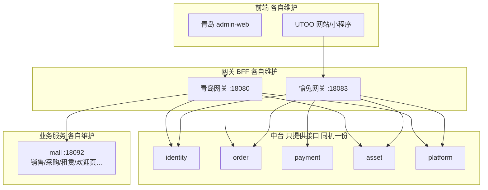

# 大平台 × UTOO · 方向与交互（权威）

> **状态**：已拍板（2026-08-20；**2026-08-24 增补方案 B**）  
> **用途**：唯一「接下来怎么做 + 系统怎么交互」入口。中途改架构须先确认再改本文件与 Cursor 规则。  
> **配套**：进程写权明细 → [微服务拆分与作用域.md](./微服务拆分与作用域.md)；**方案 B 边界** → [中台基础能力与各端业务边界-方案B.md](./中台基础能力与各端业务边界-方案B.md)；分层 → [代码组织约定.md](./代码组织约定.md)；现网端口/切流事实 → [现网架构说明.md](./现网架构说明.md)

---

## 1. 拍板原则（先记住）

| # | 原则 | 含义 |
|---|------|------|
| 1 | **大平台为主** | 部署与共用中台活跃代码以 `mall_qingdao_pydjango`（含 `platform/`）为准 |
| 2 | **业务各自服务、各自维护** | 青岛改青岛经营/网关/admin-web；UTOO 改愉兔网关/前端及自有服务；互不进对方业务仓改需求 |
| 3 | **中台只提供基础接口** | 共用能力（身份主数据/令牌、实验单、支付、资产、平台）只经 HTTP；**菜单拼装、登录编排、渠道产品逻辑在各端业务**（方案 B，见 [中台基础能力与各端业务边界-方案B.md](./中台基础能力与各端业务边界-方案B.md)） |
| 4 | **近期同机上线** | 大平台与 UTOO 部署在**同一台服务器**；中台同机只起**一套**进程 |
| 5 | **8 HTTP + Worker** | 不要把 mall 下约 20 个域目录各起进程 |

---

## 2. 项目交互逻辑

### 2.1 总览

```text
┌──────────────────────────── 同一台服务器 ────────────────────────────┐
│                                                              │
│  青岛 admin-web ──► 青岛网关 :18080                           │
│       │                 │                                    │
│       │                 ├─► /api/identity/*  ──► identity    │
│       │                 ├─► /api/orders/utoo/* ► order        │
│       │                 ├─► /api/{sales|procurement|rental|…} │
│       │                 │         └──────────► mall :18092  │
│       │                 └─►（库存/发票等）──► asset/platform   │
│                                                              │
│  UTOO 网站/小程序 ──► 愉兔网关 :18083                          │
│                         │                                    │
│                         ├─► 登录编排/菜单/me 拼装（BFF）       │
│                         ├─► 凭证/用户主数据 ──► identity      │
│                         ├─► 实验单状态机   ──► order          │
│                         ├─► 支付/回调      ──► payment       │
│                         ├─► 库存台账等     ──► asset         │
│                         ├─► 入驻/发票等     ──► platform       │
│                         └─► 愉兔独有业务   ──► utoo_biz :18093│
│                                                              │
│  中台（只提供接口，共用一份）：                                 │
│    identity:18110  order:18082  payment:18084                 │
│    asset:18090     platform:18091  worker                     │
└──────────────────────────────────────────────────────────────┘
         共库 qd_pt_new · 共用 Redis · 共 JWT 密钥
```



### 2.2 谁调谁（按场景）

| 用户动作 | 前端 | 网关 | 落到 |
|----------|------|------|------|
| 登录 / 刷新 / 凭证 | 青岛或 UTOO | 各自网关 BFF 编排 | **identity**（基础登录/JWT；非菜单树产品逻辑） |
| 改部门/角色/用户/菜单/改密 | 青岛或 UTOO | 各自网关 → identity | **identity**（主数据写） |
| 前端菜单树 / me 聚合 | 青岛或 UTOO | **各自网关或业务进程拼装** | identity 只提供原子读 |
| 实验单列表/详情/领用/开测/复测 | 两边都可 | 青岛：`/api/orders/utoo/*`；UTOO：历史 `.ajax` | **order** |
| 支付、余额、微信回调 | 主要为 UTOO | 愉兔网关 | **payment** |
| 销售/采购/租赁/欢迎页/操作日志 | 青岛 | 青岛网关 → mall | **mall** |
| 库存出入库、后台资金台账 | 两边需要时 | 各自网关 | **asset**（mall **不写**这些表） |
| 入驻、发票、会员运营配置 | 两边需要时 | 各自网关 | **platform** |

### 2.3 渠道与菜单

| 前端 | `X-Channel` | 菜单过滤 |
|------|-------------|----------|
| 青岛 admin | `mall_qd` | `sy_role.type=1` 且 `sy_menu.pt_type` 含 `1` |
| UTOO 管理端 | `admin` | `type=2` / `pt_type` 含 `2` |
| UTOO C 端 / 小程序 | `pc` / `wx` | 管理菜单为空或按 C 端规则 |

### 2.4 青岛网关转发（交互细节）

- **身份**：`IDENTITY_MID_SERVICE_URL` → 本机 `platform/identity`（本地 `services/identity` 登录 **410**）。
- **实验单**：`/api/orders/utoo/{resource}` 白名单映射到 order 的 `.ajax`（见网关 `order_proxy`）；附带 `X-Channel: mall_qd`。
- **经营域**：默认 `MALL_SERVICE_URL`（:18092）；拆分调试时才单独设 `SALES_SERVICE_URL` 等。
- **不做**：不写业务表；不实现登录；不起第二套中台。

### 2.5 愉兔网关转发（交互细节）

- 历史路径兼容（`/api/vue/*`、`/api/experimentOrder/*`、`/api/wx/*` 等）。
- 上游 `SVC_*` / 身份 / 订单 / 支付 → **本机中台**（同机上线后不要再指另一台旧中台当写权威）。
- **不做**：不 twin 实验单状态机；不本地再写一套登录库。

### 2.6 一张表一个写入口（交互底线）

| 表族 | 唯一写进程 | 其它怎么拿数据 |
|------|------------|----------------|
| `sy_*` 用户角色菜单部门 | identity | 调中台接口 |
| `experiment_order*` 样品复测 | order | 调中台接口 |
| 支付单 / 回调 / C 端余额扣减 | payment | 调中台接口 |
| 销售/采购/租赁等经营单 | mall | UTOO 一般不写这些 |
| 仓库库存出入库 / 后台台账 | asset | mall 只调接口 |
| 入驻 / 发票 / 运营配置 | platform | mall 只调接口 |

### 2.7 代码仓怎么对应交互

| 仓 / 目录 | 在交互里的角色 |
|-----------|----------------|
| `mall_qingdao_pydjango/gateway` | 青岛 BFF（含菜单拼装） |
| `mall_qingdao_pydjango/services/mall` + 域目录 | 青岛经营业务 |
| `mall_qingdao_pydjango/admin-web` | 青岛前端 |
| `mall_qingdao_pydjango/platform/*` | **中台基础能力**（只提供接口） |
| `mall_qingdao_pydjango/platform/utoo_gateway` | UTOO BFF（路径兼容、菜单/me 拼装） |
| `mall_qingdao_pydjango/services/utoo_biz` | **UTOO 独有业务**（:18093） |
| `mall_qingdao_pydjango/utoo-web-front` 等 | UTOO 前端/小程序 |
| `utoo-pydjango` 旧仓 | 只读对照，**禁止活跃发版** |
| `mall_qingdao` Java | 只读对照，不参与运行时交互 |

---

## 3. 接下来方向（完整路线）

按依赖排序；**未完成前一项的门禁，不宣称整站可替代 Java。**

### 阶段 A — 同机骨架（近期上线硬门禁）

| 序号 | 事项 | 验收 |
|------|------|------|
| A1 | 同机进程：青岛网关、愉兔网关、mall、中台（identity/order，按需 payment/asset/platform）、worker | 健康检查全绿；中台只一份 |
| A2 | 两边网关环境变量指本机中台；JWT/DB/Redis 一致 | 青岛与 UTOO 均能登录；停中台两边 503 |
| A3 | Worker 纳入同机部署（支付通知等） | 回调/通知不丢 |
| A4 | 禁止同机第二套 `qd_svc_*` 写进程 | 进程列表可核对 |

### 阶段 B — 中台接口稳定（供两边调用）

| 序号 | 事项 | 验收 |
|------|------|------|
| B1 | identity：登录/me/菜单/组织写/改密契约文档化 | 两渠道菜单不错位 |
| B2 | order：实验单白名单与错误码稳定；青岛 admin 列表+详情动作 | 与 UTOO 同库同单状态一致 |
| B3 | payment / asset / platform：青岛需要的只读或写路径改为调中台 | mall **无**库存/发票双写 |
| B4 | 中台改动只进大平台 `platform/` | SOURCE/发版记录可追溯 |

### 阶段 C — 大平台经营覆写（业务各自维护）

按强制流程：**梳理 Java → 复写（views→services→repositories）→ 交叉测试 + 前端按钮测 → 才算完成。**

| 序号 | 模块 | 当前粗状态 | 下一动作 |
|------|------|------------|----------|
| C1 | 欢迎页 / 页签 / 操作日志 | 已有 | 回归 + 菜单挂接 |
| C2 | 销售 / 库存销售 | 列表与写闭环有基础 | 对齐 Java 按钮与状态机缺口 |
| C3 | 自主采购 | 有清单与实现 | 按 `docs/rewrite/procurement-清单` 测完再标完成 |
| C4 | 租赁 / 调租 | 本批前端加强 | 借贷/校准写能力按清单推进 |
| C5 | 生产 / 外仓 / 售后 | 骨架未全挂 mall | 挂进 mall urls → 前端测 |
| C6 | 商品 catalog | 偏只读 | 按需覆写；实验主数据仍走 order |
| C7 | 支撑域（营销/物流/内容…） | 占位 | 排期后逐个，勿一次拆进程 |

### 阶段 D — UTOO 侧收敛（业务各自维护）

| 序号 | 事项 | 验收 |
|------|------|------|
| D1 | 愉兔网关上游全部切同机中台 | 不再依赖旧机中台写权威 |
| D2 | 前端/小程序只改调用与兼容，不新增本地写库 | Code review 无 twin |
| D3 | 旧 `qd_svc_*` 目录停止活跃发版 | 只读对照或删除发版任务 |

### 阶段 E — 切流与归档

| 序号 | 事项 | 验收 |
|------|------|------|
| E1 | 流量切到同机网关 | 错误率、支付回调、OSS 正常 |
| E2 | Java 写路径关闭（按表族） | 一张表一个写进程 |
| E3 | 文档只保留本文件 + 写权/分层/现网/API/IOT | 无互相打架的「双权威」叙述 |

### 明确不做（方向上的红线）

- 为 EMKU 再拆一套 identity/order/payment（二期只加渠道）。
- 把 mall `services/` 默认拆成 20 个进程。
- 在 mall 再实现库存/发票写库。
- 在愉兔网关或青岛网关实现实验单状态机。
- 未测完就宣称「模块覆写完成」。

---

## 4. 本机与同机怎么跑（交互相关）

**大平台仓：**

```powershell
cd E:\mall_qingdao_pydjango
.\scripts\start-dev.ps1              # Core：admin-web + gateway + mall + identity (+ order)
.\scripts\start-dev.ps1 -IncludeUtoo  # + payment / asset / platform
```

**UTOO：** 同机再起愉兔网关 + 前端；网关中台 URL 指 `127.0.0.1:18110` / `:18082` 等。

默认端口见 [微服务拆分与作用域.md](./微服务拆分与作用域.md)。

---

## 5. 文档地图（清理后只留这些）

### 平台权威（`E:\utoo\docs\`）

| 文档 | 用途 |
|------|------|
| **本文件** | **方向 + 交互**（日常第一入口） |
| [微服务拆分与作用域.md](./微服务拆分与作用域.md) | 进程职责、写权表、并发 |
| [代码组织约定.md](./代码组织约定.md) | 分层与覆写流程 |
| [现网架构说明.md](./现网架构说明.md) | 现网/UAT 端口与切流事实 |
| [API对照表.md](./API对照表.md) | Java `.ajax` ↔ 新 API |
| [本机联调环境包.md](./本机联调环境包.md) | 换机联调 |
| UTOO-IOT*.md | 与 IOT 联调（独立主题） |

### 大平台仓内保留

| 文档 | 用途 |
|------|------|
| `docs/代码组织约定.md` | 与平台分层一致（仓内副本） |
| `docs/rewrite/*-清单.md` | 单模块覆写清单（欢迎页/日志/采购等） |
| `docs/READ_ONLY_API_CATALOG.md` | 首批兼容 API 契约 |
| `platform/README.md` + `SOURCE.md` | 中台目录说明与迁仓来源 |

### 已删除（过时或与拍板冲突）

见本仓库 git 删除记录：原「双仓长期双权威」「缺口矩阵过时行」「重复切流/索引」等已并入本文件后移除，避免再按旧文档决策。

---

## 6. 改代码前自检

1. 这是 **业务** 还是 **中台接口**？业务 → 各自仓；中台 → 只改 `platform/` 并保持接口兼容。  
2. 会不会造成 **第二份写进程**？  
3. 覆写是否走完 **梳理 → 复写 → 按钮测**？  
4. 不确定表权属 / 渠道 / 是否拆进程 → **先问人，再写代码**。
