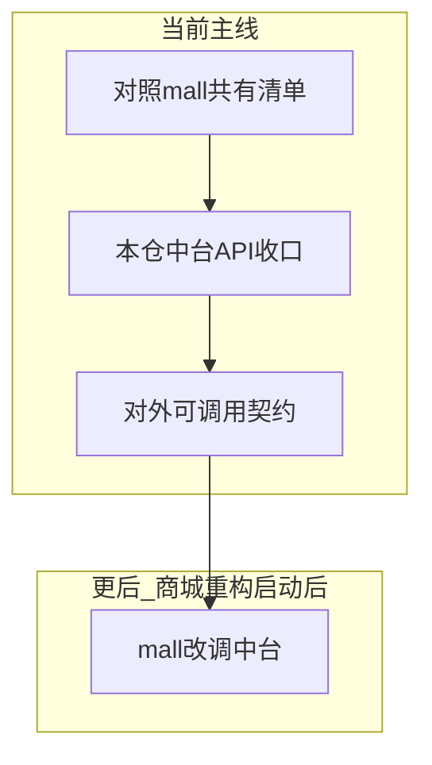

# 愉兔与青岛商城中台抽离流程（中台优先）

> **当前主线：只在本仓把共有愉兔能力收成中台 API。**  
> **`E:\qd\mall_qingdao` 暂不重构、不改代码、不切流量。** 商城仅作「共有能力对照源」。  
> 对内收口见 [中台后续流程与复杂度.md](./中台后续流程与复杂度.md)；能力归属见 [中台能力清单.md](./中台能力清单.md)；  
> 共有项明细见 [中台共有能力抽离清单.md](./中台共有能力抽离清单.md)。

## 1. 目标与原则

### 1.1 目标

| 系统 | 路径 | 当前角色 |
|------|------|----------|
| 愉兔（UTOO） | 本仓 `utoo-pydjango` | **中台建设主战场**（网关 + `qd_svc_*`） |
| 青岛商城 | `E:\qd\mall_qingdao` | 对照清单来源；本阶段不动。**目标重构为 Django**（不以 Java 为目标架构） |

**近目标（现在）：** 共有能力在本仓只留一份可稳定调用的 HTTP 面（对内先可用，再对外就绪）。  
**远目标：** 青岛商城以 **Django** 重建后，共有愉兔功能经 BFF/HTTP 调本仓中台；电商本域留在商城 Django；遗留 Java 下线。详见桌面《愉兔与青岛商城_Django中台调用流程与可行性》。



### 1.2 原则

1. **中台优先**：工程「抽离」= 本仓把共有逻辑收进 `qd_svc_*` 并具备稳定 API，**不是**从商城 Java 仓库剪切代码。
2. **商城冻结**：未宣布启动商城重构前，零改动 `mall_qingdao`。
3. **先清单后收口**：M1 定共有项 → M2 域收口 → M3 对外契约预留。
4. **写入口唯一**：状态变更只走负责 svc；见 [中台数据与发版治理.md](./中台数据与发版治理.md)。
5. **电商本域不进中台**：销售 / 租赁 / 采购 / 购物车等留在商城。
6. **消费方差异用通道**：预留 `X-Channel=mall_qd`；见 [中台身份与菜单约定.md](./中台身份与菜单约定.md)。现在不接商城，只定约定。

---

## 2. 两边功能对照（摘要）

重叠主要在实验 UT 栈与数字化 UTOO 部分，不在购物车。决策表详见 [中台共有能力抽离清单.md](./中台共有能力抽离清单.md)。

| 现象（商城） | 中台落点 |
|--------------|----------|
| `/utexperimentOrder` 等双栈 | `qd_svc_order` → **抽离（P0）** |
| 分包/子单 `utexperimentSub*` | `qd_svc_order` → **抽离（P0）** |
| 样品状态嵌在子单 | `qd_svc_order` → **抽离（P0）** |
| `digitalManage` 的 UTOO 统计/下钻 | `qd_svc_admin_asset` → **抽离读接口（P1）** |
| 实验主数据 / lab | order / asset → **P2** |
| 销售/租赁/采购/AMK | — → **不抽离** |

---

## 3. 目标调用关系（分期）

| 阶段 | 愉兔前端/小程序 | mall_qingdao |
|------|-----------------|--------------|
| **现在（M1～M3）** | 打本仓网关 → svc（对内中台） | **仍用内嵌 ut\***，不改 |
| **商城重构后（M4+）** | 同上 | 愉兔功能只打中台 HTTP（鉴权 + `X-Channel`） |

数据：短期策略待拍板（共用库 / 同步 / 中台唯一写）；**禁止**商城与中台长期双写同一实验订单状态机。

---

## 4. 分阶段流程（中台优先）

```text
M1 共有能力路径级清单
  → M2 中台域收口（订单 → 数字化读 → 库存/实验室绑定）
  → M3 对外消费契约就绪（供以后商城调用；现在不接商城）
  → M4+（冻结）商城改调中台 / 下线双写  —— 仅当宣布启动商城重构后
```

### M1 — 共有能力路径级清单

| 项 | 内容 |
|----|------|
| 输入 | 商城 `ut*` 扫描 + [中台能力清单.md](./中台能力清单.md) |
| 输出物 | [中台共有能力抽离清单.md](./中台共有能力抽离清单.md)（可继续补路径细项） |
| 完成标准 | 每项有负责 svc、优先级、状态列；排除项清晰 |
| 不做 | 改商城；开生产切流 |

### M2 — 中台域收口（本仓工程）

| 项 | 内容 |
|----|------|
| 输入 | M1 的 P0/P1 |
| 动作 | 按 [中台订单域试点.md](./中台订单域试点.md) 收口订单；再数字化读；再 P2。开对应 `SVC_*_URL`，冻结网关 twin 新业务 |
| 完成标准 | 愉兔管理端/C 端主路径走 svc；共有逻辑不在网关新增第二份 |
| 不做 | 改 `mall_qingdao`；对外正式接商城 |

### M3 — 对外消费契约（预留）

| 项 | 内容 |
|----|------|
| 输入 | M2 已稳定的订单（及已收口读接口） |
| 输出物 | 对外路径清单、鉴权与 `X-Channel=mall_qd` 约定、示例（curl/脚本） |
| 完成标准 | **模拟外部客户端**可调通主路径；文档可交给以后商城重构使用 |
| 不做 | 改商城页面；关闭商城 `ut*`；生产切商城流量 |

### M4+ — 商城重构接入 / 下线双写（冻结）

| 项 | 内容 |
|----|------|
| 触发条件 | **明确宣布启动 `mall_qingdao` 重构** |
| 内容 | `ut*` 页改调中台 → 验收后下线平行写与 `*_utoo` 双写 |
| 不做 | 把青岛电商本域迁入愉兔中台 |

---

## 5. 建议首批抽离范围

**P0：** 实验主单 / 子单 / 分包；样品状态查询与展示  
**P1：** 数字化中心 UTOO 统计与下钻（读）  
**P2：** 实验主数据；实验室/库存强绑定  
**排除：** 销售、购物车、租赁、采购、AMK/Emku

---

## 6. 与「对内中台」的关系

| 维度 | 文档 | 现在做什么 |
|------|------|------------|
| 对内 | [中台后续流程与复杂度.md](./中台后续流程与复杂度.md) 等 | M2 与之对齐，同一套 `qd_svc_*` |
| 对外预留 | 本文 M3 | 契约与通道，**不接商城** |
| 对外落地 | M4+ | 商城重构启动后 |

不另起中台仓库。

---

## 7. 维护

- 阶段状态变更时更新本文与 [docs/README.md](./README.md)。  
- 根目录 [README.md](../README.md) **保持原版不动**；补充说明见 [README1.md](../README1.md)。  
- 清单细项维护在 [中台共有能力抽离清单.md](./中台共有能力抽离清单.md)。
