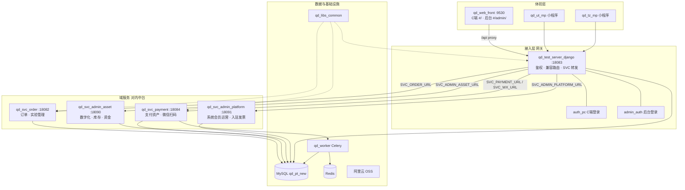
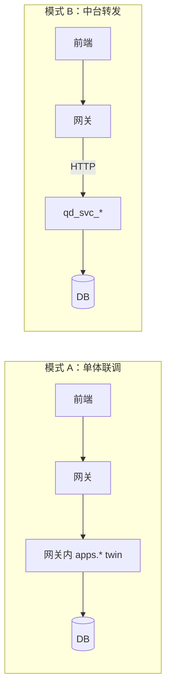
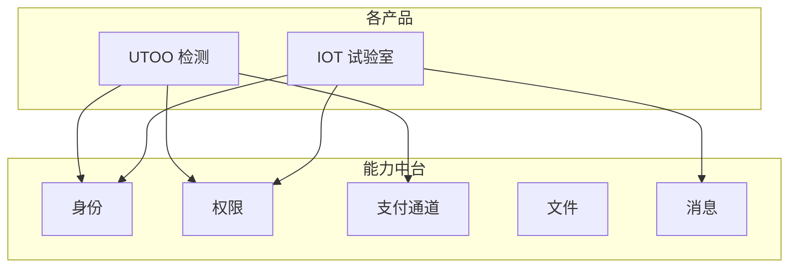
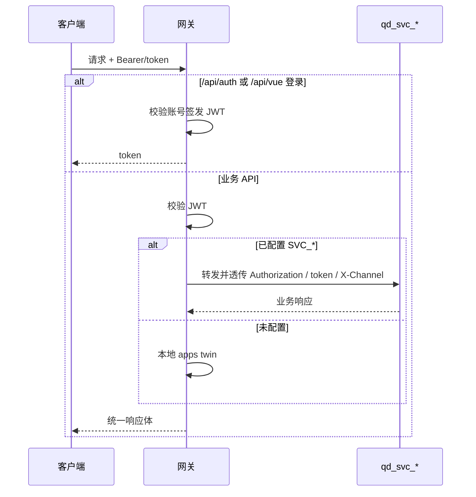
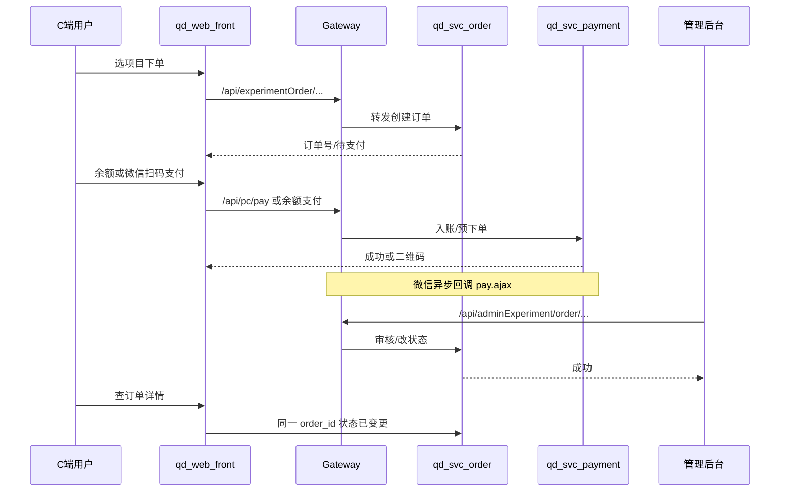
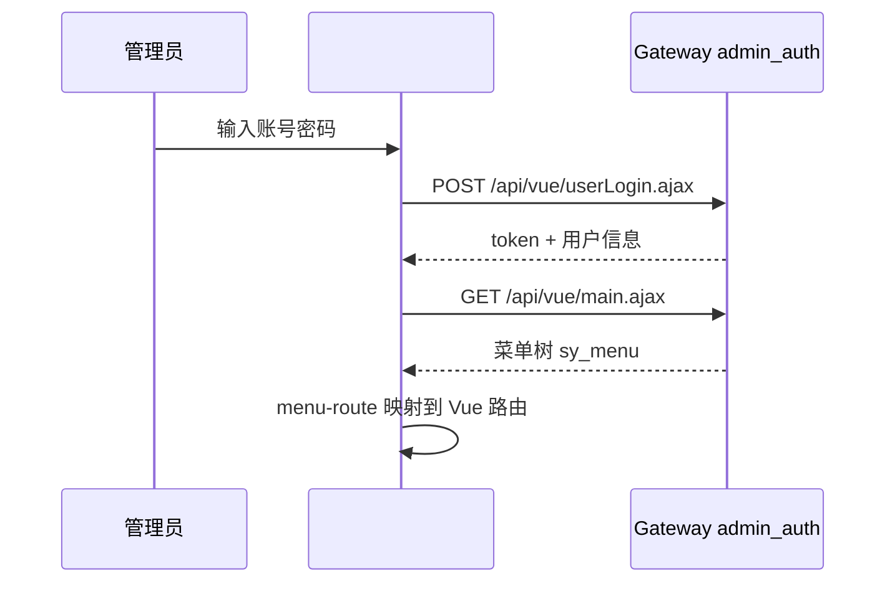

# 愉兔检测平台 · 项目架构、中台建设与接口逻辑说明

> **文档定位**：一份总览，覆盖「现在是什么架构」「对内中台怎么做」「接口请求怎么走」。  
> **代码仓**：http://gitlab.wisecom-tech.com/web/utoo-pydjango.git（分支 `dev`）  
> **更新日期**：2026-08  
> **关联专项**：monorepo 内 `docs/中台*.md`（能力清单、订单试点、身份约定等）

---

## 目录

1. [项目一句话](#1-项目一句话)
2. [整体架构](#2-整体架构)
3. [仓库与端口](#3-仓库与端口)
4. [请求链路与运行模式](#4-请求链路与运行模式)
5. [对内中台：怎么做](#5-对内中台怎么做)
6. [跨产品能力中台（远期）](#6-跨产品能力中台远期)
7. [接口逻辑说明](#7-接口逻辑说明)
8. [关键业务时序](#8-关键业务时序)
9. [配置与启动](#9-配置与启动)
10. [文档索引](#10-文档索引)

---

## 1. 项目一句话

**愉兔检测（UTOO）** 是检测服务交易与履约平台：客户在 C 端选项目、下单、支付、开票；运营在管理后台审核订单、管实验主数据、看资金/库存/数字化；微信小程序复用同一套后端。

技术形态：**Vue3 统一前端 + Django 网关（BFF）+ 按域微服务 + 共用业务库（迁移期）**。

---

## 2. 整体架构



### 分层职责

| 层 | 组件 | 职责 | 不做什么 |
|----|------|------|----------|
| 体验层 | `qd_web_front`、小程序 | UI、路由、调 `/api/*` | 不拼订单/支付状态机 |
| 接入层 | 网关 | JWT 校验、兼容旧 `.ajax`、按 `SVC_*` 转发 | 新业务逻辑不写在 twin |
| 域服务 | `qd_svc_*` | 领域读写、状态变更唯一真相 | 禁止互相 import 业务模块 |
| 公共库 | `qd_libs_common` | 响应体、序列化、OSS URL、密码兼容 | 不写业务规则 |
| 数据 | MySQL / Redis / OSS | 迁移期共用库；锁与回调队列 | 测试勿指向业务库名 |

---

## 3. 仓库与端口

| 目录 | 端口 | 说明 |
|------|------|------|
| `qd_web_front` | **9530** | 统一 SPA：C 端 + 管理后台 |
| `qd_test_server_django` | **18083** | API 网关 / BFF |
| `qd_svc_order` | 18082 | 订单 + 后台实验管理 |
| `qd_svc_payment` | 18084 | 支付 / 资产 + 部分 `/api/wx/*` |
| `qd_svc_admin_asset` | 18090 | 数字化 / 库存 / 资金 |
| `qd_svc_admin_platform` | 18091 | 会员运营系统 / 入驻 / 发票 |
| `qd_worker` | — | Celery（支付回调等） |
| `qd_libs_common` | — | `qd_common` 包 |
| `qd_ut_mp` / `qd_tz_mp` | — | 微信小程序工程 |
| `config/` | — | `shared-database.env` |

**已废弃（勿再启）：** `qd_svc_auth`、`qd_svc_wx`、`qd_svc_invoice`、`qd_svc_entry`；旧 `qd_test_front_v3` / `qd_admin_front` 已并入 `qd_web_front`。

**对照仓（不在 monorepo）：** Java `qd_test_server`、冻结 FastAPI `qd_test_server_py`。

---

## 4. 请求链路与运行模式

### 4.1 两种运行模式



| 模式 | 条件 | 用途 |
|------|------|------|
| **A 单体** | 不配 `SVC_*_URL` | 日常开发：只起前端 + 网关 |
| **B 转发** | 配置对应 `SVC_*_URL` | 预发/生产/中台试点：逻辑以 svc 为准；上游未启则 **503** |

### 4.2 网关始终驻留（不转发）

| 模块 | 路径 | 说明 |
|------|------|------|
| C 端认证 | `/api/auth/*` | `auth_pc`：login / refresh / me |
| 后台认证 | `/api/vue/*`、`/api/admin/userLogin.ajax` | `admin_auth` |
| 公众号回调 | `/api/wx/wechatconfig.ajax` | 需 XML/echostr，本地处理 |
| 小程序别名 | `/api/wx/*`（非扫码 4 接口） | `wx_mp` |
| 健康检查 | `/health` | — |

### 4.3 转发开关（网关 `.env`）

```env
# 勿设 SVC_AUTH_URL
SVC_ORDER_URL=http://127.0.0.1:18082
SVC_PAYMENT_URL=http://127.0.0.1:18084
SVC_WX_URL=http://127.0.0.1:18084
SVC_ADMIN_ASSET_URL=http://127.0.0.1:18090
SVC_ADMIN_PLATFORM_URL=http://127.0.0.1:18091
SVC_INVOICE_URL=http://127.0.0.1:18091
SVC_ENTRY_URL=http://127.0.0.1:18091
```

改 `.env` 后须**重启网关**。实现见 `apps/core/svc_proxy.py` 与各 `*_forward`。

---

## 5. 对内中台：怎么做

> **对内中台** ≠ 推倒重来。底座已有；核心是「每个能力只落在一个服务、两端共用、网关只转发」。

### 5.1 原则

1. **新功能只进负责 `qd_svc_*`**，网关最多加路由 / `@forward_*_first`。  
2. **禁止**微服务互相 `import` 业务模块；跨域用 HTTP 或 Celery。  
3. 管理端与 C 端 UI 可不同，**同一状态变更必须走同一 service**。  
4. 差异用角色 / 配置 / `X-Channel`，**不按端拆服务**。  
5. 迁移期共用 `qd_pt_new`，但须明确「表的写归属服务」。

### 5.2 能力归属（简表）

| 能力 | 负责服务 | 主要前缀 |
|------|----------|----------|
| 后台登录 / 欢迎页 / 菜单壳 | **网关** `admin_auth` | `/api/vue/*` |
| C 端登录 | **网关** `auth_pc` | `/api/auth/*` |
| 实验订单 / 子单 / 复测 / 实验主数据 | `qd_svc_order` | `/api/experimentOrder/*`、`/api/adminExperiment/*` … |
| 支付 / 充值 / 资产流水 | `qd_svc_payment` | `/api/pc/*`（支付相关）、`/api/offlineRecharge/*` … |
| 微信扫码 / 预约 / 反馈 | `qd_svc_payment` | `/api/wx/` 扫码 4 接口 |
| 数字化 / 库存 / 资金台账 | `qd_svc_admin_asset` | `/api/digital/*`、`/api/funds/*` … |
| 系统会员运营 / 入驻 / 发票 | `qd_svc_admin_platform` | `/api/sys/*`、`/api/entry/*`、`/api/invoice/*` … |

完整表见 monorepo：`docs/中台能力清单.md`。

### 5.3 推进顺序（已写进流程文档）

```text
文档约定（已完成）
  → ① 订单域试点（开 SVC_ORDER_URL）
  → ② 支付域收口
  → ③ 资产域收口
  → ④ 平台域收口
  → ⑤ 生产核心域常开 SVC_*，冻结 twin 新业务
```

**订单试点要点：**

- 两端订单主路径只打 order 服务路径族。  
- 启动：`.\scripts\start-order-pilot.ps1` 或 `start-order` + 网关。  
- 验收：创建 → 后台可见 → 审核/取消 → C 端状态一致。  
- 详见：`docs/中台订单域试点.md`。

### 5.4 身份与渠道

| 主体 | 登录 | Token | Cookie |
|------|------|-------|--------|
| C 端会员 | `POST /api/auth/login` | JWT | `token` |
| 后台员工 | `POST /api/vue/userLogin.ajax` | JWT | `admin_token` |

请求头约定：

- `Authorization: Bearer <token>`
- `token: <token>`（兼容旧 Java）
- 可选 `X-Channel`: `pc` | `admin` | `wx`（审计用，网关转发须透传）

密钥：全仓 `config/shared-database.env` 的 `JWT_SECRET_KEY`。

---

## 6. 跨产品能力中台（远期）

当公司还有 **IOT 运维、其它检测线** 等产品时，下列能力适合再抽成**独立部署的能力中台**（与对内中台不矛盾，是下一阶段）：

| 优先级 | 能力 | 说明 |
|--------|------|------|
| P0 | 身份 Identity / 权限 IAM | 统一登录、租户、菜单 |
| P0 | 文件 Media | OSS 凭证与上传 |
| P1 | 支付通道 PayCore | 预下单、回调验签；**业务入账仍在产品域** |
| P1 | 消息 Notify | 微信模板 / 短信 |
| — | 检测订单 / 设备 Blockly / AGV | **留各产品业务域，不进能力中台** |

目标示意：



详见：`docs/中台可行性架构示例.md`（工作区）与 Cursor Canvas `utoo-middle-platform-architecture`。

---

## 7. 接口逻辑说明

### 7.1 统一入口

所有浏览器 / 小程序请求：

```text
客户端 → http://127.0.0.1:9530/api/...  （Vite 代理）
       → http://127.0.0.1:18083/api/... （网关）
       → 本地 twin 或 HTTP 转发到 qd_svc_*
```

生产经 Nginx 反代到网关；微信回调必须打到公网网关路径。

### 7.2 路径前缀 → 域

| 前缀 | 逻辑归属 | 转发变量 |
|------|----------|----------|
| `/api/auth/` | C 端认证 | 无（网关） |
| `/api/vue/`、`/api/admin/userLogin.ajax` | 后台认证 | 无（网关） |
| `/api/pc/` | C 端兼容聚合（个人中心/资产/部分支付） | 视接口：payment / order / platform |
| `/api/experimentOrder/`、`/api/experimentChildOrder/`、`/api/experimentSubOrder/` | 订单 | `SVC_ORDER_URL` |
| `/api/saleOrder/`、`/api/bill/`、`/api/adminExperiment/` … | 订单 / 实验管理 | `SVC_ORDER_URL` |
| `/api/offlineRecharge/`、`/api/paymentapply/`、支付相关 pc | 支付 | `SVC_PAYMENT_URL` |
| `/api/wx/` 扫码 4 接口 | 微信能力 | `SVC_WX_URL`→18084 |
| `/api/invoice/`、`/api/entry/` | 发票 / 入驻 | →18091 |
| `/api/digital/*`、`/api/funds/*`、库存等 | 资产域 | `SVC_ADMIN_ASSET_URL` |
| `/api/sys/*`、`/api/member/*`、运营等 | 平台域 | `SVC_ADMIN_PLATFORM_URL` |

网关挂载顺序见 `qd_test_server_django/config/urls.py`（精确路由优先，避免前缀吞掉其它域）。

### 7.3 鉴权逻辑



响应体约定：C 端多兼容 Java `{ code, message, data }` 或 `{ res, resMsg, obj }`；公共封装见 `qd_common.responses`。

### 7.4 C 端主要接口族（逻辑）

| 场景 | 典型接口 | 说明 |
|------|----------|------|
| 登录 | `POST /api/auth/login` | body: name/password/loginType |
| 刷新 | `POST /api/auth/refresh` | refresh_token |
| 当前用户 | `GET /api/auth/me` | — |
| 注册/验证码 | `/api/pc/register.ajax` 等 | pc_compat |
| 首页分类 | `/api/pc/indexClassList.ajax` | 项目目录 |
| 我的订单 | `/api/experimentOrder/*` 或 pc 订单 ajax | 归属 order |
| 资产 | `GET /api/pc/center/getAccount.ajax` | amount / arrearAmount / invoicingAmount |
| 余额支付 / 扫码 | `/api/pc/*.ajax` 支付相关 | 归属 payment |
| 开票 | `/api/invoice/*`、pc 开票 ajax | → platform |
| 微信扫码登录态 | `/api/wx/WeChatQRCodeGenerator.ajax` 等 | → payment（若开 SVC_WX） |

### 7.5 管理后台主要接口族（逻辑）

| 场景 | 典型接口 | 说明 |
|------|----------|------|
| 登录 | `POST /api/vue/userLogin.ajax` | loginName/password → admin_token |
| 壳 / 欢迎页 | `/api/vue/main.ajax`、`welcome.ajax` | 菜单树 |
| 实验订单管理 | `/api/adminExperiment/order/*` | → order |
| 实验主数据 | `/api/adminExperiment/{brand,project,goods}/*` | → order |
| 数字化 / 资金 | `/api/digital/*`、`/api/funds/*` | → asset |
| 系统用户角色 | `/api/sys/*` | → platform |
| 运营广告等 | `/api/admin/advert_*.ajax` 等 | → platform |

### 7.6 资产金额语义（易错）

`GET /api/pc/center/getAccount.ajax`：

| 字段 | 含义 |
|------|------|
| `amount` / `accountBalance` | `user_account.amount` **充值余额**（可余额支付） |
| `arrearAmount` | 待支付汇总 |
| `invoicingAmount` | 可开票金额 |
| `netBalance` | 仅参考展示（余额 − 待支付） |

**余额支付只扣 `amount`**，不是扣 `netBalance`。

### 7.7 微信支付回调

| 场景 | 路径 |
|------|------|
| 订单支付 | `{CORS_HTTPS}/api/pc/pay.ajax` |
| 充值 | `{CORS_HTTPS}/api/pc/rechargePay.ajax` |
| 还款 / 多选 | `{CORS_HTTPS}/api/pc/amountPayBack.ajax` |

`CORS_HTTPS` 为公网根，**勿带 `/api`**。本地需穿透或 UAT。可选 `PAY_NOTIFY_USE_QUEUE=true` 走 Celery。

---

## 8. 关键业务时序

### 8.1 C 端下单 → 支付 → 后台审核（示意）



### 8.2 后台登录拿菜单



---

## 9. 配置与启动

### 9.1 本地最小集

```powershell
# 库配置
copy config\shared-database.env.example config\shared-database.env

# 网关
cd qd_test_server_django
.\.venv\Scripts\activate
python run.py

# 前端
cd qd_web_front
npm run dev
```

| 地址 | 用途 |
|------|------|
| http://127.0.0.1:9530/#/home | C 端 |
| http://127.0.0.1:9530/#/admin/login | 管理后台 |
| http://127.0.0.1:18083/health | 网关健康检查 |

### 9.2 中台联调（网关 + 4 svc）

```powershell
.\scripts\start-ms-dev.ps1
# 或订单试点
.\scripts\start-order-pilot.ps1
```

### 9.3 配置加载顺序

1. 各服务 `.env`  
2. 根目录 `config/shared-database.env`（DB_*、JWT）  
3. `.env.local`（本机覆盖，不提交）

---

## 10. 文档索引

### 本工作区 `E:\utoo\docs\`

| 文档 | 说明 |
|------|------|
| **本文** | 架构 + 中台 + 接口总览 |
| [中台可行性架构示例.md](./中台可行性架构示例.md) | 跨产品能力中台示意 |
| [进度总览.md](./进度总览.md) | 日常进度入口 |
| [API对照表.md](./API对照表.md) | Java → 新 API 明细 |
| [开发启动.md](./开发启动.md) | 一键启动 |

### Monorepo `utoo-pydjango/docs/`（对内中台专项）

| 文档 | 说明 |
|------|------|
| [中台能力清单.md](../utoo-pydjango/docs/中台能力清单.md) | 能力 → 服务 → 端 |
| [中台后续流程与复杂度.md](../utoo-pydjango/docs/中台后续流程与复杂度.md) | 推进顺序与难度 |
| [中台网关下沉与转发.md](../utoo-pydjango/docs/中台网关下沉与转发.md) | SVC_* 与 twin |
| [中台身份与菜单约定.md](../utoo-pydjango/docs/中台身份与菜单约定.md) | JWT / X-Channel |
| [中台订单域试点.md](../utoo-pydjango/docs/中台订单域试点.md) | 订单收口执行清单 |
| [中台域收口方法.md](../utoo-pydjango/docs/中台域收口方法.md) | 支付/资产/平台复制方法 |
| [中台数据与发版治理.md](../utoo-pydjango/docs/中台数据与发版治理.md) | 表写归属 |

---

## 附录：纪律速查

```text
新需求来了？
  1. 查「中台能力清单」→ 进哪个 qd_svc_*
  2. 只在该服务写业务；网关只加转发
  3. 前端只调 /api/...，不拼状态机
  4. 预发打开对应 SVC_*_URL 验收
  5. 禁止再在网关 twin 堆新领域逻辑
```

**完成标准（对内中台）：** 生产核心域常开 `SVC_*_URL`；订单/支付/资产/平台主链路不依赖网关内业务实现；管理端与 C 端无第二套后端状态机。
